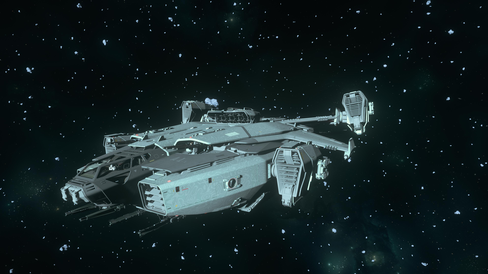

## Requirement

| Quantity | Content                                             |
|----------|-----------------------------------------------------|
| 50       | [Wikelo Favor](../Wikelo Favor.md)                  |
| 5        | [RCMBNT-PWL-1](../../Items/Hyperion.md)             |
| 5        | [RCMBNT-PWL-2](../../Items/Hyperion.md)             |
| 5        | [RCMBNT-PWL-3](../../Items/Hyperion.md)             |
| 5        | [RCMBNT-RGL-1](../../Items/Hyperion.md)             |
| 5        | [RCMBNT-RGL-2](../../Items/Hyperion.md)             |
| 5        | [RCMBNT-RGL-3](../../Items/Hyperion.md)             |
| 5        | [RCMBNT-XTL-1](../../Items/Hyperion.md)             |
| 5        | [RCMBNT-XTL-2](../../Items/Hyperion.md)             |
| 5        | [RCMBNT-XTL-3](../../Items/Hyperion.md)             |
| 3        | [ASD Secure Drive](../../Items/ASD Secure Drive.md) |

{ align=right }
/// caption
Image from [LazyBrokOli](https://imgur.com/a/19J9zvQ){target="_blank"}
///

